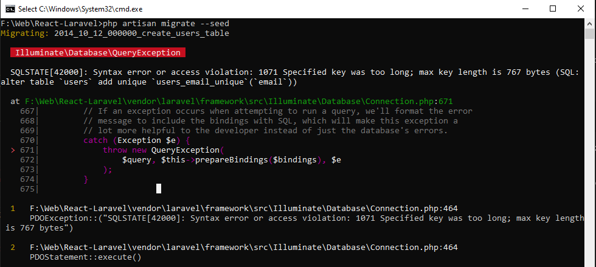

# Learning Laravel - Practical experience
Laravel has the most extensive and thorough [documentation](https://laravel.com/docs) and video tutorial library of all modern web application frameworks, making it a breeze to get started with the framework.

## Installation from Git Repository
- git clone
```sh
git clone git_repository
```

- composer install
```sh
composer install
composer run-script post-autoload-dump
composer run-script post-root-package-install
composer run-script post-create-project-cmd
```

- Edit .env file  
Update DB_DATABASE, DB_USERNAME, DB_PASSWORD

- DB migrate
```sh
php artisan migrate --seed
```

- Local Development Server
```sh
php artisan serve
```

## Possible Errors And Exceptions
When you try to install Laravel and working on the Laravel project, there might be this kind of problem.

### Laravel Migration Error
```sh
php artisan migrate --seed
```
Syntax error or access violation: 1071 Specified key was too long; max key length is 767 bytes (SQL: alter table `users` add unique `users_email_unique`(`email`))
<p align="center">
    
</p>  

__*Answer*__  
<i>According to the official [documentation](https://laravel.com/docs/master/migrations#creating-indexes), you can solve this quite easily.

Add following code to AppServiceProvider.php (/app/Providers/AppServiceProvider.php)
```php
use Illuminate\Database\Schema\Builder; // Import Builder where defaultStringLength method is defined

function boot()
{
    Builder::defaultStringLength(191); // Update defaultStringLength
}
```
MySQL reserves always the max amount for a UTF8 field which is 4 bytes so with 255 + 255 with your DEFAULT CHARACTER SET utf8mb4 COLLATE utf8mb4_unicode_ci; you are over the 767 max key length limit. By @scaisedge
</i>

__Reference link:__  https://stackoverflow.com/questions/42244541/laravel-migration-error-syntax-error-or-access-violation-1071-specified-key-wa


